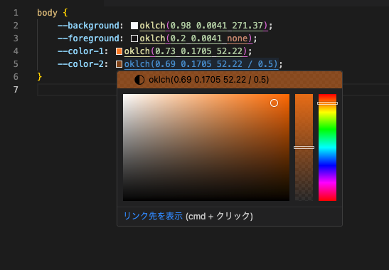

# oklch-vscode

This is a Visual Studio Code extension that provides a preview of OKLCH colors in your CSS files.



## Features

- **OKLCH Color Preview**: Preview OKLCH colors in your CSS files.
- **OKLCH Color Picker**: Use the color picker to select OKLCH colors.
- **Generate Link to [oklch.com](https://oklch.com/)**: Generate a link to the OKLCH color on the [oklch.com](https://oklch.com/).

## Settings

You can customize the file patterns for which the extension will be active. By default, it is set to `css`, `scss`, `less`, `tailwindcss` and `postcss`. You can change this in your settings:

```json
"oklch-vscode.languages": [
    "css",
    "scss",
    "less",
    "tailwindcss",
    "postcss"
]
```

## License

[Apache License 2.0](LICENSE)
